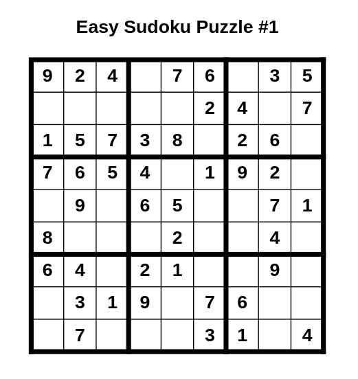

# Sudoku Puzzle Generator



This is a **Sudoku Puzzle Generator** written in Python, supporting the generation of Sudoku puzzles of varying difficulty levels (`easy`, `medium`, `hard`). The generator allows for customizable clue counts, optional puzzle symmetry, and the creation of professional-grade Sudoku puzzles. It can also generate PDFs of the puzzles and their solutions. The generator leverages **multiprocessing** to use all available CPU cores, making the puzzle generation process faster.

## Features

- **Customizable Difficulty**: Generate puzzles with `easy`, `medium`, or `hard` difficulty levels.
- **Custom Clue Count**: Specify the number of clues for each puzzle (e.g., `hard:1:17` generates a hard puzzle with exactly 17 clues).
- **Optional Symmetry**: Use the `--use-symmetry` flag to generate puzzles with symmetrical clue placement for a professional-grade look.
- **Solution Generation**: Generate a separate PDF with solutions for the puzzles.
- **Parallel Puzzle Generation**: Uses multiprocessing to generate puzzles in parallel, utilizing all available CPU cores for faster generation.
- **PDF Output**: Outputs generated puzzles and solutions as PDFs.

## Installation

To use this project, make sure you have Python 3.x installed and the necessary dependencies:

1. Clone this repository:
   ```bash
   git clone https://github.com/alicommit-malp/sudoku
   cd sudoku
   ```

2. Install dependencies:
   ```bash
   pip install -r requirements.txt
   ```

### Dependencies

- `numpy`: Used for managing the Sudoku grid.
- `fpdf`: For generating PDFs of the puzzles and solutions.
- `argparse`: For parsing command-line arguments.
- `multiprocessing`: To parallelize puzzle generation.

## Usage

You can run the Sudoku generator from the command line using the `python` command. Below are examples of different ways to run the generator.

### Basic Example

Generate **10 easy puzzles** with **40 clues** and **5 medium puzzles** with **35 clues**, without symmetry:

```bash
python sudoku.py -config easy:10:40 -config medium:5:35 -output sudoku_puzzles.pdf
```

### Generating Hard Puzzles with Exactly 17 Clues

Generate **5 hard puzzles** with **exactly 17 clues**, using symmetry and advanced difficulty checking, along with solutions:

```bash
python sudoku.py -config hard:5:17 -output sudoku_puzzles.pdf --use-symmetry --gen-answers
```

### Command Line Arguments

- `-config`: Specify the difficulty level and the number of puzzles to generate in the format `difficulty:count:clues`. You can provide multiple configurations. 
  - Example: `-config easy:10:40` generates 10 easy puzzles with 40 clues each.
  - You can also omit the clue count, and a default will be used based on the difficulty.
  
- `-output`: Specify the name of the output PDF file (e.g., `sudoku_puzzles.pdf`).

- `--gen-answers`: If this flag is provided, a second PDF with the solutions will be generated.

- `--use-symmetry`: If this flag is provided, the puzzles will be generated with symmetrical clue placement for a professional-grade appearance.

### Default Clue Counts

If you do not provide a clue count for a puzzle, the following default values will be used based on difficulty:

- `easy`: 40 clues
- `medium`: 35 clues
- `hard`: 30 clues

## Examples

### Generate 5 Hard Puzzles with 17 Clues Each:

```bash
python sudoku.py -config hard:5:17 -output hard_puzzles.pdf --gen-answers
```

This will generate 5 hard puzzles with exactly 17 clues each, and the solutions will be saved in `hard_puzzles_answers.pdf`.

### Generate Mixed Difficulty Puzzles:

```bash
python sudoku.py -config easy:10:40 -config medium:5:35 -config hard:3:30 -output mixed_puzzles.pdf
```

This will generate:
- 10 easy puzzles with 40 clues each.
- 5 medium puzzles with 35 clues each.
- 3 hard puzzles with 30 clues each.

### Enable Symmetry:

To enable symmetrical clue placement in the puzzles, use the `--use-symmetry` flag:

```bash
python sudoku.py -config hard:5:17 -output symmetrical_hard_puzzles.pdf --use-symmetry
```

### Generate Puzzles in Parallel:

The generator automatically detects the number of CPU cores available and parallelizes the puzzle generation process. No additional flags are needed for multiprocessing.

## Contributing

Feel free to fork this repository and submit pull requests for improvements or bug fixes. If you have any issues or feature requests, please open an issue.

## License

This project is licensed under the MIT License.
