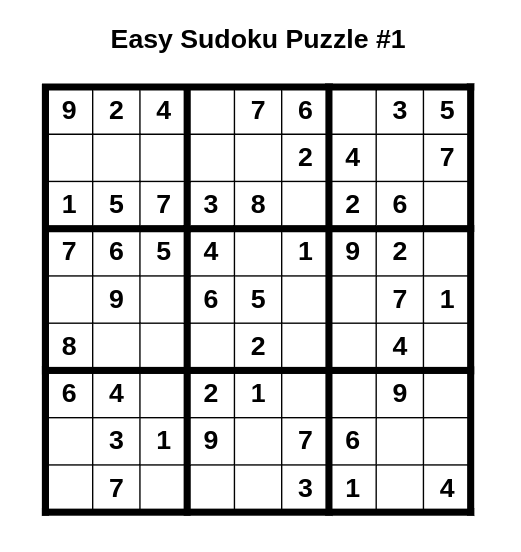

# Sudoku Puzzle Generator



This is a **Sudoku Puzzle Generator** written in Python. It produces puzzles with **guaranteed unique solutions**, supports a target clue count and optional 180° rotational symmetry, and writes the result (with optional answer key) to PDF. It runs each puzzle in parallel across all CPU cores via `multiprocessing`.

There's also a **single-page browser version** in [`docs/`](docs/) that ports the same generator to vanilla JS, with an interactive solver and an in-browser PDF download. See [Web version](#web-version) below.

## Features

- **Difficulty presets**: `easy` / `medium` / `hard` (defaults: 40 / 35 / 30 clues).
- **Target clue count**: pass `difficulty:count:clues`. The generator removes as many cells as it can without breaking uniqueness — so the achieved count is **at least** the requested target. Symmetric mode is more constrained and typically settles around 35–38 clues regardless of the target. The CLI prints a note when a target wasn't reachable.
- **180° symmetry** (`--use-symmetry`): clues are placed symmetrically; uniqueness is still enforced, so symmetric puzzles often end up with more clues than requested.
- **Answer PDF** (`--gen-answers`): writes a second PDF with the solutions.
- **Parallel generation**: every puzzle runs concurrently across all available cores.

## Installation

To use this project, make sure you have Python 3.x installed and the necessary dependencies:

1. Clone this repository:

   ```bash
   git clone https://github.com/alicommit-malp/sudoku
   cd sudoku
   ```

2. Install dependencies:

   ```bash
   pip install -r requirements.txt
   ```

### Dependencies

- `numpy`: Used for managing the Sudoku grid.
- `fpdf`: For generating PDFs of the puzzles and solutions.
- `argparse`: For parsing command-line arguments.
- `multiprocessing`: To parallelize puzzle generation.

## Usage

You can run the Sudoku generator from the command line using the `python` command. Below are examples of different ways to run the generator.

### Basic Example

Generate **10 easy puzzles** with **40 clues** and **5 medium puzzles** with **35 clues**, without symmetry:

```bash
python sudoku.py -config easy:10:40 -config medium:5:35 -output sudoku_puzzles.pdf
```

### Targeting a Low Clue Count

Generate **5 hard puzzles** targeting **17 clues** with symmetry and an answer key:

```bash
python sudoku.py -config hard:5:17 -output sudoku_puzzles.pdf --use-symmetry --gen-answers
```

`17` is the mathematical lower bound for a uniquely-solvable Sudoku, and the parser rejects anything below it. In practice, symmetric removal often can't get all the way down to 17 without making the puzzle ambiguous, so the achieved clue count will typically be higher. The CLI prints a per-group note like:

```text
hard: requested 17 clues, 5/5 puzzle(s) ended up with more (min=36, max=38) — uniqueness preserved.
```

### Command Line Arguments

- `-config` (repeatable): difficulty / count / target-clues, in the form `difficulty:count:clues`. The clue field is optional — defaults are used when omitted.
- `-output`: output PDF path.
- `--gen-answers`: also write `<output>_answers.pdf` containing the solutions.
- `--use-symmetry`: 180° rotational symmetric clue placement.

### Default Clue Counts

Used when the third field of `-config` is omitted:

- `easy`: 40 clues
- `medium`: 35 clues
- `hard`: 30 clues

## Examples

### Mixed-difficulty batch

```bash
python sudoku.py -config easy:10:40 -config medium:5:35 -config hard:3:30 -output mixed_puzzles.pdf
```

Generates 10 easy + 5 medium + 3 hard puzzles into a single PDF, with a title page per difficulty group.

### Symmetric puzzles

```bash
python sudoku.py -config hard:5:25 -output symmetric_hard.pdf --use-symmetry --gen-answers
```

## Web version

A self-contained, single-file browser version lives in [`docs/index.html`](docs/index.html). It ports the generator to vanilla JS, adds an interactive solver (live conflict highlighting, "Check" against the unique solution, "Reveal", etc.), and uses [jsPDF](https://github.com/parallax/jsPDF) for in-browser PDF downloads. No build step.

To preview locally:

```bash
python3 -m http.server -d docs 8000
# open http://localhost:8000/
```

To deploy to GitHub Pages: in the repo's *Settings → Pages*, set **Source** to *Deploy from a branch* and **Folder** to `/docs`.

## Testing

The Python generator has a `unittest` test suite covering the core invariants (uniqueness, 180° symmetry, given/solution consistency) plus regressions for the bugs that have been fixed in this repo. Run from the repo root:

```bash
python -m unittest discover tests
```

## Contributing

Feel free to fork this repository and submit pull requests for improvements or bug fixes. If you have any issues or feature requests, please open an issue.

## License

This project is licensed under the MIT License.
